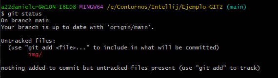

# Ejemplo-GIT2

1.Creación de repositorio en GitHub, inicializándolo con un README.md y el .gitignore que GiHub ofrece para Java.
    Creo repositorio, le llamo Ejemplo-Git2.
    Marco la opcion para que genere el readme y el gitignore (en el ignore selecciono java)
    

2.Modificación de este README.md desde GitHub para indicar lo dos primeros pasos.

3.Clono el repositorio desde Github con el terminal.

$ git clone https://github.com/DanielCamposRocha/Ejemplo-GIT2.git
El repositorio se me crea y descarga dentro de esta carpeta generando una nueva carpeta Ejemplo-GIT2 dentro de Ejemplo-GIT2

4. Muevo los archivos a la carpeta original
5. Hago push

6.Fuerzo fallos, para ver que pasa, hago commit en github y aqui en el readme y a ver que pasa.

